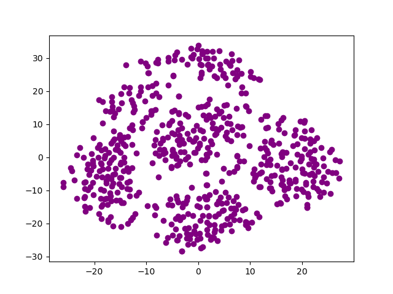
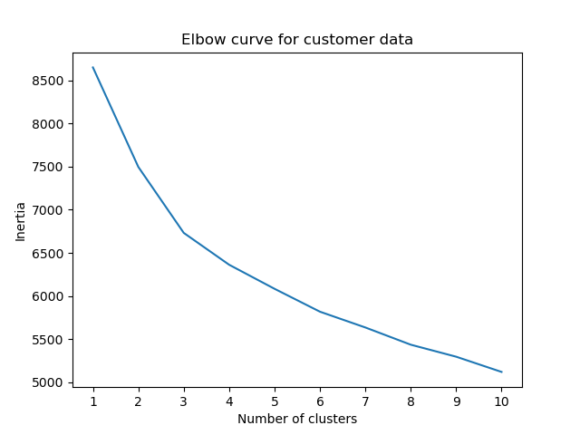

# unsupervised-machine-learning-challenge

## Prepare the Data
1. Read myopia.csv into a Pandas DataFrame.
2. Remove the "MYOPIC" column from the dataset.
3. Standardize your dataset so that columns that contain larger values do not influence the outcome more than columns with smaller values.

## Apply Dimensionality Reduction
1. Perform dimensionality reduction with PCA. 
2. Further reduce the dataset dimensions with t-SNE and visually inspect the results. To do this, run t-SNE on the principal components, which is the output of the PCA      transformation.
3. Create a scatter plot of the t-SNE output. 

## Perform a Cluster Analysis with K-means
1. Create an elbow plot to identify the best number of clusters. Make sure to do the following:
2. Use a for loop to determine the inertia for each k between 1 through 10.
3. Determine where the elbow of the plot is, and at which value of k it appears.

## Recommendation
Based on the dimensionality reduction with PCA and t-sne model, there seem to be five clusters.
On permorming the Cluster Analysis with K-means, the optimal k

The scatter plot obtained from the t-sne output and the K-means elbow plot is shown below 

